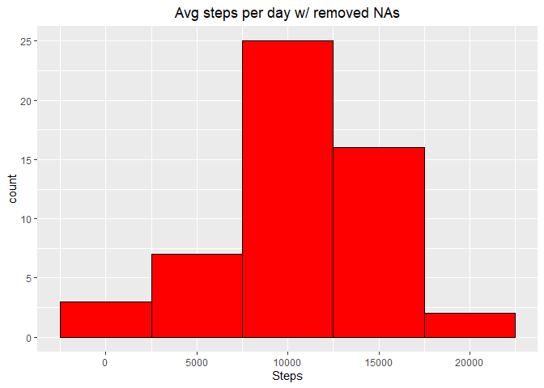
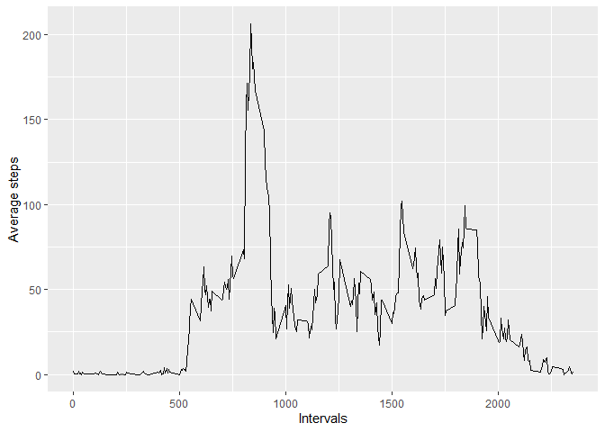
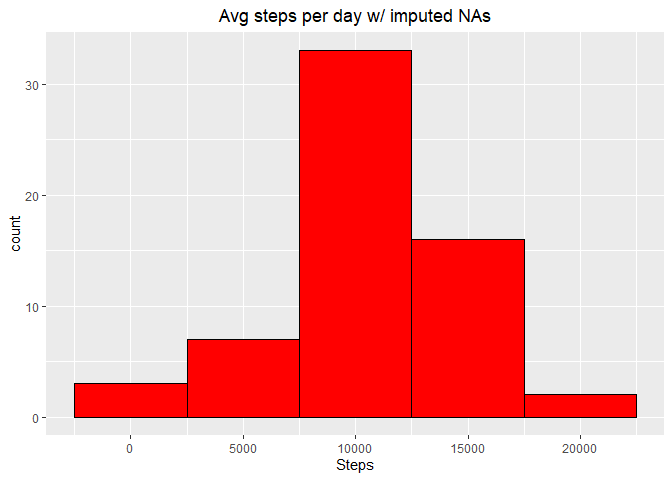
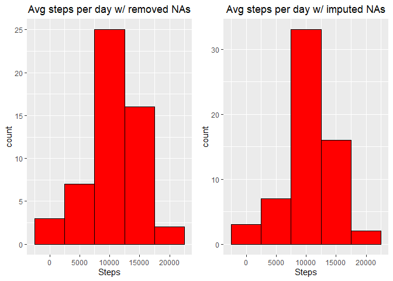
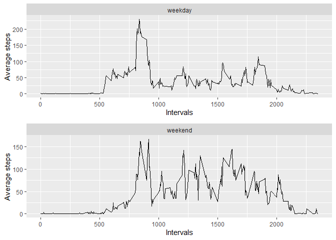

# Reproducible Research: Peer Assessment 1

This is a work made for the John Hopkins's course "Reproducible Research". The main objective of this work is to fullfill the requirments of the assessment by creating a research reporte that includes exploratory data analysis by using R Markdown and knitr options.

I worked with data given in the course where is collected the number of steps given by a user. The data is divided by days and 5 min. intervals.


## Loading and preprocessing the data

First, I loaded and preprocessed the data just to look at it and understand what kind of "problems" my data had. I noticed that the data frame has 3 columns:

* steps
* date
* interval

I also noticed that the NA's of the orginal data frame were only in the "steps" column. The total number of NAs is 2304. I worked with 3 different data frames. The first one was the original data frame, called "data"; the second one, called "datadate", is a dataframe with the "date" column preprocessed. The third dataframe called "dataclean" has all the NA's removed.


```r
library(lubridate)
```

```
## 
## Attaching package: 'lubridate'
```

```
## The following objects are masked from 'package:base':
## 
##     date, intersect, setdiff, union
```

```r
library(dplyr)
```

```
## 
## Attaching package: 'dplyr'
```

```
## The following objects are masked from 'package:lubridate':
## 
##     intersect, setdiff, union
```

```
## The following objects are masked from 'package:stats':
## 
##     filter, lag
```

```
## The following objects are masked from 'package:base':
## 
##     intersect, setdiff, setequal, union
```

```r
library(gridExtra)
```

```
## 
## Attaching package: 'gridExtra'
```

```
## The following object is masked from 'package:dplyr':
## 
##     combine
```

```r
library(ggplot2)

data <- read.csv("./activity.csv")  ## Read the data
datadate <- mutate(data, date = ymd(data$date))  ## Change type of class for date
dataclean <- filter(datadate, !is.na(datadate$steps))  ## Clean data from NA's 
head(data)
```

```
##   steps       date interval
## 1    NA 2012-10-01        0
## 2    NA 2012-10-01        5
## 3    NA 2012-10-01       10
## 4    NA 2012-10-01       15
## 5    NA 2012-10-01       20
## 6    NA 2012-10-01       25
```

```r
head(datadate)
```

```
##   steps       date interval
## 1    NA 2012-10-01        0
## 2    NA 2012-10-01        5
## 3    NA 2012-10-01       10
## 4    NA 2012-10-01       15
## 5    NA 2012-10-01       20
## 6    NA 2012-10-01       25
```

```r
head(dataclean)
```

```
##   steps       date interval
## 1     0 2012-10-02        0
## 2     0 2012-10-02        5
## 3     0 2012-10-02       10
## 4     0 2012-10-02       15
## 5     0 2012-10-02       20
## 6     0 2012-10-02       25
```

```r
print("NAs in steps column: ", quote = FALSE)
```

```
## [1] NAs in steps column:
```

```r
sum(is.na(datadate$steps))
```

```
## [1] 2304
```

```r
print("NAs in date column: ", quote = FALSE)
```

```
## [1] NAs in date column:
```

```r
sum(is.na(datadate$date))
```

```
## [1] 0
```

```r
print("NAs in interval column: ", quote = FALSE)
```

```
## [1] NAs in interval column:
```

```r
sum(is.na(datadate$interval))
```

```
## [1] 0
```


## What is mean total number of steps taken per day?


```r
sumsteps <- data.frame()
for(i in unique(dataclean$date)){
  a <- filter(dataclean, date == i)
  b <- sum(a$steps)
  sumsteps <- rbind(sumsteps, b)
}

colnames(sumsteps) <- "averageOfStepsperday"

p <- ggplot(sumsteps, aes(x = averageOfStepsperday)) + 
  geom_histogram(binwidth = 5000, color = "black", fill = "red") + 
  labs(x = "Steps") +
  ggtitle("Avg steps per day w/ removed NAs") +
  theme(plot.title = element_text(hjust = 0.5))

p
```

<!-- -->

```r
mean1 <- mean(sumsteps$averageOfStepsperday)
median1 <- median(sumsteps$averageOfStepsperday)

print("Mean: ", quote = FALSE)
```

```
## [1] Mean:
```

```r
mean1
```

```
## [1] 10766.19
```

```r
print("Median: ", quote = FALSE)
```

```
## [1] Median:
```

```r
median1
```

```
## [1] 10765
```

I used a binwidth of 5000 for the plot to be visualy understandable. I've got a mean of __1.0766189\times 10^{4}__ and a median of __10765__.

## What is the average daily activity pattern?


```r
dailypat <- data.frame()
for(i in unique(dataclean$interval)){
  a <- filter(dataclean, interval == i)
  b <- mean(a$steps)
  dailypat <- rbind(dailypat, b)
}
dailypat <- cbind(unique(dataclean$interval),dailypat)

colnames(dailypat) <- c("interval", "AverageSteps")


ggplot(dailypat, aes(unique(dataclean$interval), AverageSteps)) +
  geom_line() + 
  labs(x = "Intervals", y = "Average steps")
```

<!-- -->

```r
dailymax <- filter(dailypat, dailypat$AverageSteps == max(dailypat[, "AverageSteps"]))

maxsteps <- dailymax$AverageSteps

print("Interval: ", quote = FALSE)
```

```
## [1] Interval:
```

```r
interval1 <- dailymax$interval
interval1
```

```
## [1] 835
```
This is the behaviour of the average steps depending on the intevals of the data frame. The maximum average of steps is 206.1698113 and are found in the __interval 835.__


## Imputing missing values


```r
## count number of na's over the days and create a dataframe
## with the information

daysna <- data.frame()
daynumb <- data.frame()
for(i in unique(data$date)){
  day <- filter(data, date == i)
  daysna <- rbind(daysna, sum(is.na(day$steps)))
  
  daynumb <- rbind(daynumb, day[1, 2])
  
}
colnames(daysna) <- "NAsindays"
colnames(daynumb) <- "date"
daynumb <- mutate(daynumb, date = ymd(daynumb$date))
daysna <- cbind(daysna, daynumb)


## Substitute the NA's using the mean of steps by intervals of 5 min

datanafill <- data.frame()
for(i in 1:nrow(datadate)){
  a <- datadate[i, ]
  if(is.na(a$steps) == TRUE){
    d <- a$interval
    e <- filter(dailypat, interval == d)
    f <- e$AverageSteps
    a <- mutate(a, steps = f)
    datanafill <- rbind(datanafill, a)
  }
  else{
    datanafill <- rbind(datanafill, a)}
}


## Plot

sumdatanafill <- data.frame()
for(i in unique(datanafill$date)){
  a <- filter(datanafill, date == i)
  b <- sum(a$steps)
  sumdatanafill <- rbind(sumdatanafill, b)
}

colnames(sumdatanafill) <- "averageOfStepsperday"

library(ggplot2)
q <- ggplot(sumdatanafill, aes(x = averageOfStepsperday)) + 
  geom_histogram(binwidth = 5000, color = "black", fill = "red") + 
  labs(x = "Steps") +
  ggtitle("Avg steps per day w/ imputed NAs") +
  theme(plot.title = element_text(hjust = 0.5))

q
```

<!-- -->

```r
grid.arrange(p, q, nrow = 1)
```

<!-- -->

```r
print("Mean: ", quote = FALSE)
```

```
## [1] Mean:
```

```r
mean(sumdatanafill$averageOfStepsperday)
```

```
## [1] 10766.19
```

```r
print("Median: ", quote = FALSE)
```

```
## [1] Median:
```

```r
median(sumdatanafill$averageOfStepsperday)
```

```
## [1] 10766.19
```

```r
difmean <- mean(sumdatanafill$averageOfStepsperday) - mean1
difmedian <- median(sumdatanafill$averageOfStepsperday) - median1


print("Difference between mean of data with NAs removed and data with NAs imputed: ", quote = FALSE)
```

```
## [1] Difference between mean of data with NAs removed and data with NAs imputed:
```

```r
difmean
```

```
## [1] 0
```

```r
print("Difference between median of data with NAs removed and data with NAs imputed: ", quote = FALSE)
```

```
## [1] Difference between median of data with NAs removed and data with NAs imputed:
```

```r
difmedian
```

```
## [1] 1.188679
```
Here I'm printing a plot comparing the dataframe where the NAs where removed and the NAs being imputed. We can observe that there is a difference between the two plots. However, the difference between them is minimum.

We can watch that the __difference between means is 0.__
There is a minimum change in the median of the dataframes, giving a difference of __1.1886792.__


## Are there differences in activity patterns between weekdays and weekends?


```r
## Add a column with factor telling if the day is a weekday or a weekend day.

dataweeks <- data.frame()
for(i in 1:nrow(datanafill)){
  a <- datanafill[i, ]
  g <- weekdays(a$date)
  if(g %in% c("lunes", "martes", "miércoles", "jueves", "viernes")){
    h <- "weekday"
    a <- mutate(a, day = h)
    dataweeks <- rbind(dataweeks, a)
  }
  else{
    j <- "weekend"
    a <- mutate(a, day = j)
    dataweeks <- rbind(dataweeks, a)}
}


## Trying to plot the average of steps by the 5 min intervals.

dataweeks$day <- as.factor(dataweeks$day)

## Separate the dataset in "day factors" 

dataweekdays <- filter(dataweeks, day == "weekday")


dataweekends <- filter(dataweeks, day == "weekend")


## Average steps by intervals of weekdays

weekdaypat <- data.frame()
for(i in unique(dataweekdays$interval)){
  a <- filter(dataweekdays, interval == i)
  b <- mean(a$steps)
  weekdaypat <- rbind(weekdaypat, b)
}
weekdaypat <- cbind(unique(dataweekdays$interval),weekdaypat)

colnames(weekdaypat) <- c("interval", "AverageSteps")


a1 <- data.frame()
for(i in 1:288){
  a1 <- rbind(a1, "weekday")
}
colnames(a1) <- "day"

weekdaypat <- cbind(weekdaypat, a1)


r <- ggplot(weekdaypat, aes(unique(dataweekdays$interval), AverageSteps)) +
  geom_line() + 
  labs(x = "Intervals", y = "Average steps") +
  facet_grid(~ day)


## Average steps by intervals of weekends

weekendpat <- data.frame()
for(i in unique(dataweekends$interval)){
  a <- filter(dataweekends, interval == i)
  b <- mean(a$steps)
  weekendpat <- rbind(weekendpat, b)
}
weekendpat <- cbind(unique(dataweekends$interval),weekendpat)

colnames(weekendpat) <- c("interval", "AverageSteps")


a2 <- data.frame()
for(i in 1:288){
  a2 <- rbind(a2, "weekend")
}
colnames(a2) <- "day"

weekendpat <- cbind(weekendpat, a2)


s <- ggplot(weekendpat, aes(unique(dataweekends$interval), AverageSteps)) +
  geom_line() + 
  labs(x = "Intervals", y = "Average steps") + 
  facet_grid(~ day)

grid.arrange(r, s, nrow = 2)
```

<!-- -->
